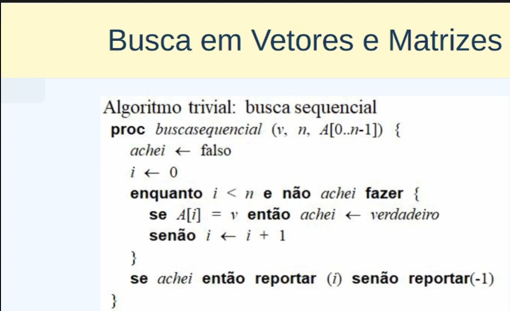
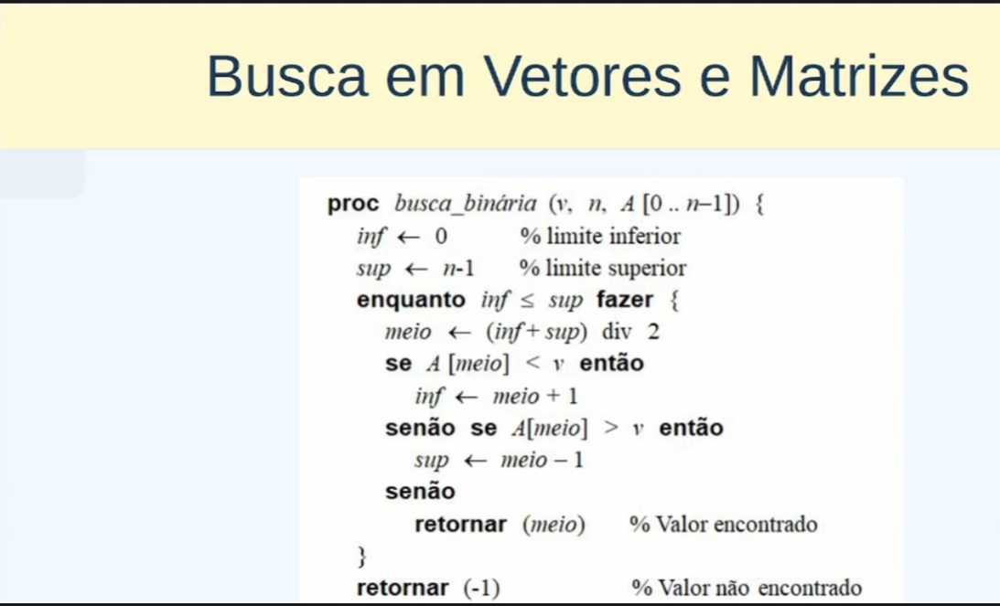

# Estrutura de dados - conceitos e estudo

## Capítulo 1: Fundamentos da estrutura de dados

### - Objetivo 2 Tipos abstratos de dados

- Tipos abstratos de dados

## Capítulo 2: Estrutura de dados elementares

- Vetores e matrizes

problemas de alocação de memória

Maneiras de resolver este problema: 

* rearranjamento de estrutura de dados;

* Realocar memória

* Estruturas de dados dinâmica:

* Busca binária

