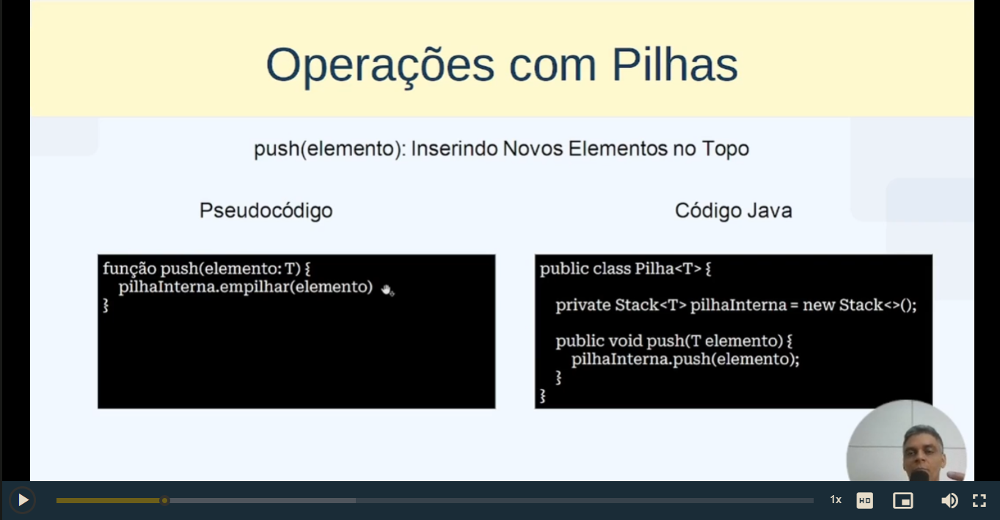

# Estrutura de dados - conceitos e estudo

## Capítulo 1: Fundamentos da estrutura de dados

### - Objetivo 2 Tipos abstratos de dados

- Tipos abstratos de dados

## Capítulo 2: Estrutura de dados elementares


### Vetores e matrizes


problemas de alocação de memória

Maneiras de resolver este problema: 

* rearranjamento de estrutura de dados;

* Realocar memória

* Estruturas de dados dinâmica:


* Busca binária


- Inserção e remoção de elementos

### Ponteiros, registros e Listas encadeadas

- Ponteiro: armazena o endereço de outra variável

## Capítulo 3: Listas, pilhas e filas

### Lista

> A Lista pode ser representada como um vetor ou umas lista de elementos sequenciados

> A lista é uma estrutura de dados homogênea ou heterogêna

- Operações com listas em Java


- Tipos de operções de listas em Python


- Aplicacoes de listas em Java


- Aplicações de Lista usando Java

```java
public class Estoque{

    private ArrayList<Produto> produtos;

    public Estoque(){
        produtos = new ArrayList<>();
    }

    public void adicionarProduto(Produto produto){
        produtos.add(produto);
    } 
    
    public void removerProduto(String nome){
        produtos.removeIf(produto --> produto.getNome().equals(nome));
    }

    public void listarProdutos(){
        for(Produto produto : produtos){
            System.out.println(produto);
        }
    }
}
```

- Gerenciamentos de tarefas em Java : Linked Lists


### Pilha

As pilhas podem ser comparadas com tarefas utilizadas no dia dia.


- Operações com Pilha: função PUSH

